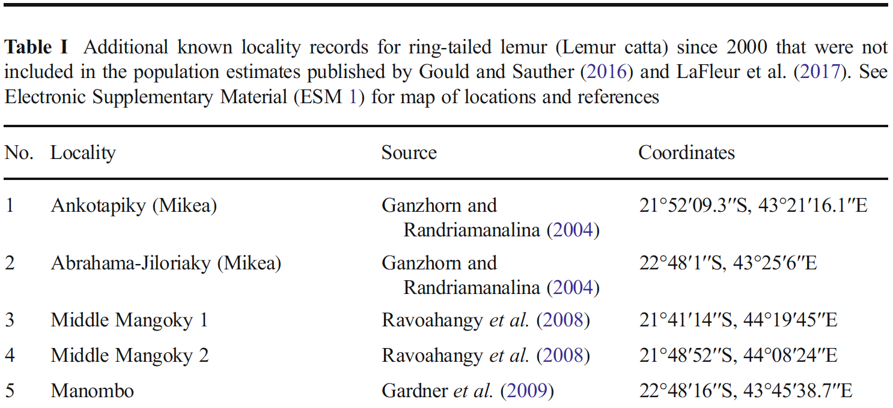
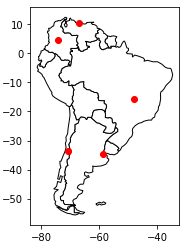

# Proposal for `extractify`

### Project Goals
In biology articles, there are tables listing sample names and locations through GPS coordinates. More often than not they are hard to copy over to a Word or Excel document and rewritting them can be time consuming, tedious, and prone to error if there are a lot of sample locations. In addition, depedning on how the GPS coordinates are presented it may require you to convert them to a standard format to plot to  Google Earth or Google Maps. This is where `extractify` comes in. The program will accomplish three things: 

1. It will read a PDF table and extract sample location names and GPS coordinates and convert that to a data frame.
2. If the coordinates are not already in decimal degrees it will covert to this format and add to data frame.
3. If the user needs a map of the coordinates it will plot the GPS coordinates to a map.

------------

### User interaction (what type of input data, what would the data look like, how will user interact with program)
The user will need to be in the directory that contains the PDF files that `extractify` will be parsing infomration from. The user will also need to specify what PDF to extract information as well as direct the program to the table the GPS coordinates are found in. The user will also be able to specificy area of interest that the coordinates are found in to give a more concise map. 

#### Example of PDF table from Murphy et al. (2017)

------------

### Output
The user will get two outputs saved to the user's directory. There will first be a CSV file containing location name, GPS coordinates for both the original and converted formats. The second output will be a image file (.png) containg a map with the coordinates plotted. 

#### Example of map output 

--------------

### Similiar tools
ArcGIS has a program that can do this but licensing fees are very costly for a student if their lab isn't already paying for it in addition this will only be looking at PDF tables not searching the whole document for GPS coordinates. 

------------
